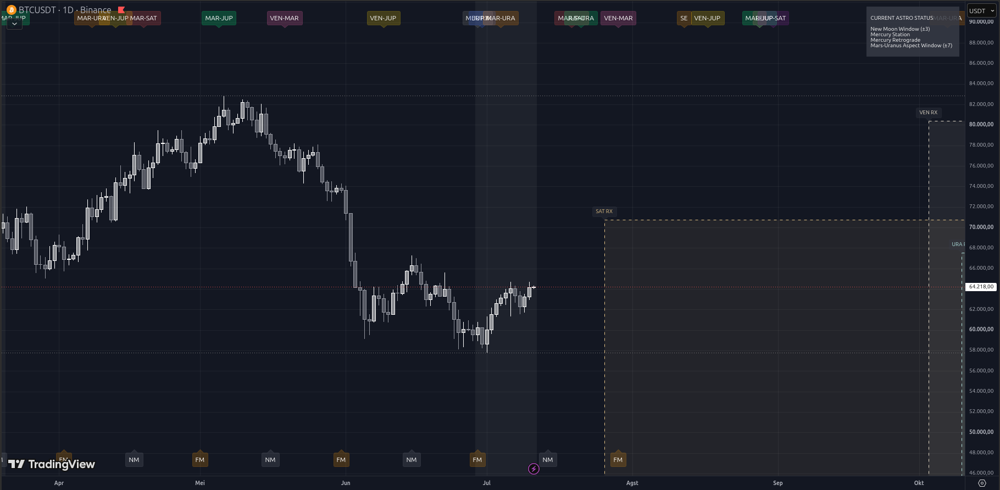

# Astro Cycles - Crypto


**Astro Cycles - Crypto** is a TradingView overlay indicator built with **Pine Script v5** designed specifically to map astronomical cycles and financial astrology directly onto price charts. It is highly optimized for analyzing the Cryptocurrency market.

This indicator plots precise historical data and projects future astronomical events—such as moon phases, eclipses, planetary retrogrades, major planetary aspects, and ingresses—to help traders identify potential time-based reversal zones.

---

---

## Key Features

* **Complex Lunar Cycles:** Displays exact *New Moon* (NM) and *Full Moon* (FM) positions along with their standard windows of influence (±3 days).
* **Eclipse Detection:** Marks *Lunar Eclipses* (LE) and *Solar Eclipses* (SE) as critical catalysts for high volatility (±5 days).
* **Retrograde (RX) & Station Zone Tracking:**
    * Tracks 6 major celestial bodies: Mercury, Venus, Mars, Jupiter, Saturn, and Uranus.
    * Highlights the chart background dynamically whenever a planet is in its retrograde phase.
    * Identifies the *Station Zone* (±7 days from the exact start/end of RX) where trend reversal tendencies are often the strongest.
    * **Future Projections:** Automatically draws dynamic dashed projection boxes into the future area of the chart to visualize upcoming retrograde periods.
* **Major Planetary Aspects:** Tracks key angular relationships between planets (e.g., Venus-Mars, Jupiter-Saturn, etc.) along with their standard orb windows (±7 days).
* **Planetary Ingress:** Marks sign-changing transitions for macro-planets like Jupiter and Uranus.
* **Real-time HUD / Status Dashboard:** Features an informative table in the top-right corner of the chart that dynamically summarizes all currently active astrological conditions.

---

## Visual Elements & Chart Legend

The indicator utilizes a rich visual system designed to keep your chart scannable and clean:

| Abbreviation / Element | Meaning | Visual Position | Default Color |
| :--- | :--- | :--- | :--- |
| **NM** | New Moon | Bottom Chart Label | Gray |
| **FM** | Full Moon | Bottom Chart Label | Orange |
| **LE** | Lunar Eclipse | Top Chart Label | Red |
| **SE** | Solar Eclipse | Top Chart Label | Orange |
| **[PLANET] RX** | Retrograde Phase Start | Top Chart Label | Planet-Specific |
| **Dashed Box** | Future RX Projection Zone | Future Price Area | Planet-Specific |
| **Dashboard** | Active Cycles Summary | Top-Right Corner | Transparent / Black |

---

## How to Install on TradingView

1.  Copy the entire code from your `.pine` script file.
2.  Open **TradingView** and load any chart.
3.  At the bottom of the screen, click on the **Pine Editor** tab.
4.  Clear any default code and paste this indicator's script.
5.  Click the **Save** button and give your script a name.
6.  Click **Add to chart** to view the indicators rendered live over the price action.

---

## How to Update or Extend Astro Data

Since the astronomical data in this script is pre-calculated and hardcoded using high-precision arrays, you will need to manually add new dates to extend the indicator's lifespan (e.g., for 2027 and beyond).

### Step-by-Step Guide to Adding New Dates:

1. Open the script in the TradingView **Pine Editor**.
2. Scroll to the specific data block you wish to update, such as `// ==== LUNAR DATA ====`, `// ==== RETROGRADE DATA ====`, `// ==== INGRESS DATA ====`, or `// ==== ASPECTS DATA ====`.
3. Locate the target array, for example:
   ```pinescript
   var string[] new_moon_dates = array.from(
        "2020-01-24", ..., "2026-12-09"
   )
---

## Disclaimer

*This indicator is developed purely for alternative technical analysis, quantitative research, and time-cycle exploration purposes. Financial astrology does not guarantee 100% accurate price movements. Always apply strict risk management, use stop-losses, and combine these cycle insights with Price Action or other momentum indicators before making any trading decisions.*
